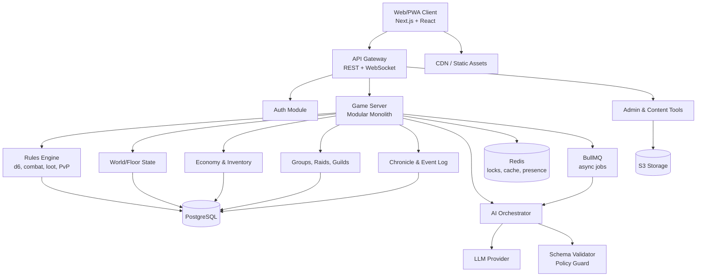
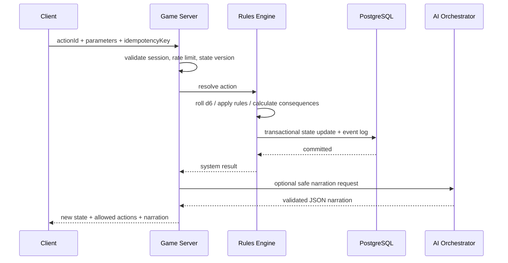
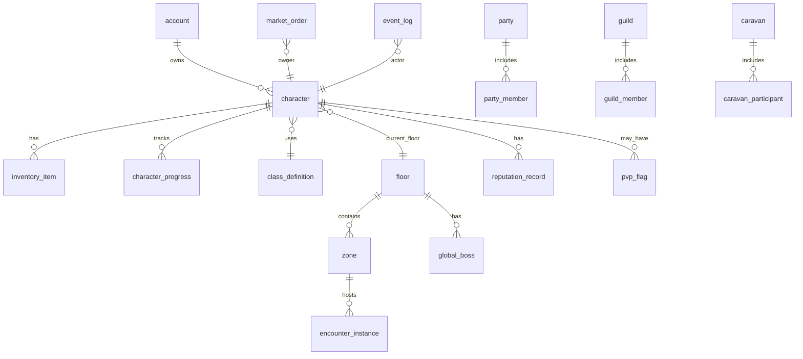
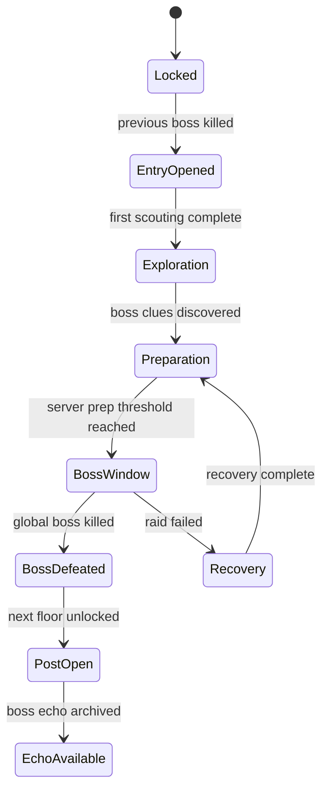
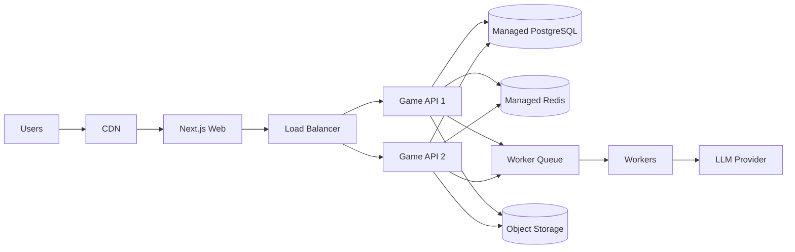

# Sword Art RPG — техническая спецификация и архитектура

## 0. Назначение документа

Этот документ переводит концепцию `sword_art_rpg_ultimate_concept.md` в техническую спецификацию: какие компоненты нужны, как они связаны, где проходят границы ответственности, какие данные хранить, как защищать экономику и правила от хаоса, как встроить ИИ без передачи ему системной власти.

Документ создан как отдельный Markdown-файл в логике рабочего процесса из статьи Битрикс24 Журнала «Ультимативный гайд по вайбкодингу по шагам»: после концепции фиксируется отдельная техническая спецификация с языками, архитектурой, структурами данных, связями и схемами.

## 0.1. Ключевой вывод для архитектуры

**Sword Art RPG лучше проектировать не как “чат с ИИ”, а как сервер-авторитетную MMO-платформу с детерминированным игровым ядром и ограниченным ИИ-слоем поверх него.**

Это означает:

- все правила, проверки, бой, лут, экономика, PvP, смерть, репутация и глобальный прогресс считаются только сервером;
- клиент никогда не присылает свободное действие, а выбирает действие из списка допустимых системных команд;
- ИИ не принимает игровые решения, не меняет числа и не выдаёт награды;
- ИИ получает от сервера уже рассчитанное состояние и формирует только безопасный нарратив, варианты описаний, реплики NPC и атмосферные детали;
- каждое важное изменение мира записывается в событийный журнал и может быть восстановлено, проверено или откатано администратором.

---

# 1. Цели технической архитектуры

## 1.1. Продуктовые цели

Архитектура должна поддерживать:

1. **Один общий мир / сервер** с единой хроникой, глобальными боссами и общим открытием этажей.
2. **Текстово-графический интерфейс**, где сцены, карты, карточки врагов и предметов дополняют текст.
3. **MMO-социальность**: группы, рейды, гильдии, торговля, караваны, вклад сообщества, фракции.
4. **Строгие правила**: d6-проверки, классы, ветки, предметы, PvE, PvP, смерть и экономика не зависят от текста ИИ.
5. **Живой мир**: этажи имеют состояния до и после убийства босса, старые этажи остаются полезными.
6. **Безопасный ИИ-слой**: только структурированный ввод/вывод, схемы, валидация и запрет свободного ввода от игрока.
7. **Пошаговую разработку**: сначала монолитный MVP, затем выделение отдельных сервисов только там, где появится реальная нагрузка.

## 1.2. Инженерные цели

Система должна быть:

- **server-authoritative** — клиент не доверенный;
- **детерминированной** — одинаковые входные команды дают проверяемый результат;
- **наблюдаемой** — логи, метрики, трассировка, аудит экономики и ИИ;
- **расширяемой контентом** — новые этажи, классы, предметы и события добавляются через контентные схемы;
- **устойчивой к злоупотреблениям** — античит, лимиты, rate limiting, защита от дюпа, проверка всех транзакций;
- **готовой к миграции** — документация и схемы в MD/JSON/YAML, чтобы проект не зависел от одного чата или инструмента.

---

# 2. Рекомендуемый технологический стек

## 2.1. Базовый стек MVP

| Слой | Рекомендация | Почему |
|---|---|---|
| Клиент | **Next.js + React + TypeScript** | Хорош для текстово-графической RPG, PWA, SSR-страниц, админки и быстрого прототипирования. |
| UI | **Tailwind CSS + shadcn/ui** | Быстрая сборка аккуратных интерфейсов, карточек, таблиц, модальных окон и панелей. |
| Сервер | **NestJS + TypeScript** | Модульная архитектура, WebSocket Gateway, валидация DTO, удобная структура для доменных модулей. |
| База данных | **PostgreSQL** | Надёжные транзакции для экономики, инвентаря, прогресса и хроники. |
| ORM | **Prisma** или **Drizzle** | Типизированный доступ к данным и миграции. Для MVP предпочтителен Prisma. |
| Realtime | **WebSocket / Socket.IO** | Сессии, группы, рейды, события локации, обновления боя и караванов. |
| Кэш и блокировки | **Redis** | Сессии, rate limits, короткие локи, очереди, presence, временные состояния. |
| Очереди | **BullMQ** | Асинхронные задачи: ИИ-генерация, отправка уведомлений, пересчёт рейтингов, cron-события. |
| Объектное хранилище | **S3-compatible storage** | Арты сцен, изображения предметов, экспорт логов, бэкапы. |
| Авторизация | Email/OAuth + JWT access + refresh tokens | Стандартная схема для web/PWA. |
| Наблюдаемость | OpenTelemetry + Prometheus/Grafana + Sentry | Ошибки клиента и сервера, latency, бизнес-метрики, трассировка. |
| Контейнеризация | Docker Compose для dev, Kubernetes/managed containers для prod | Простая локальная среда и масштабируемость позже. |

## 2.2. Почему не микросервисы с первого дня

Для текущей стадии проекта оптимальна архитектура **модульного монолита с событийным ядром**.

Причины:

- правила игры сильно связаны между собой: бой, инвентарь, экономика, прогресс и репутация часто участвуют в одной транзакции;
- микросервисы слишком рано усложнят отладку, миграции, тесты и деплой;
- контент и математика ещё будут часто меняться;
- единый сервер-авторитет проще защищать от рассинхрона и читов.

При этом монолит сразу проектируется так, чтобы отдельные части можно было вынести позже:

- AI Gateway;
- Chat/Notification service;
- Matchmaking/Encounter service;
- Analytics/Event pipeline;
- Content delivery service.

---

# 3. Высокоуровневая архитектура

## 3.1. Схема компонентов



## 3.2. Главные принципы взаимодействия

1. Клиент показывает состояние и список допустимых действий.
2. Игрок выбирает действие кнопкой, меню или заранее подготовленной репликой.
3. Клиент отправляет на сервер только `action_id` и разрешённые параметры.
4. Сервер проверяет, что действие допустимо в текущем состоянии.
5. Rules Engine считает результат: d6, модификаторы, урон, лут, репутацию, последствия.
6. Состояние сохраняется в PostgreSQL в транзакции.
7. Важные изменения записываются в `event_log`.
8. Если нужен текст, AI Orchestrator получает безопасный контекст и генерирует описание по JSON-схеме.
9. Сервер валидирует ответ ИИ и отдаёт клиенту финальное системное состояние + нарратив.

---

# 4. Архитектурный стиль: модульный монолит + event log

## 4.1. Доменные модули

| Модуль | Ответственность |
|---|---|
| `auth` | Аккаунты, сессии, роли, refresh-токены, бан-листы. |
| `players` | Профиль игрока, настройки, достижения аккаунта. |
| `characters` | Персонажи, классы, ветки, характеристики, опыт, статусы. |
| `world` | Башня, этажи, зоны, маршруты, поселения, состояния открытия. |
| `content` | Версионированные шаблоны врагов, предметов, квестов, этажей, действий. |
| `encounters` | PvE-сцены, боевые столкновения, мини-боссы, проверки окружения. |
| `combat` | d6-пулы, инициативы, урон, эффекты, смерть, воскрешение. |
| `bosses` | Глобальные боссы, подготовка сервера, окна боя, first kill, эхо боссов. |
| `inventory` | Предметы, стаки, экипировка, durability, привязки, перенос. |
| `economy` | Валюты, ресурсы, крафт, торговля, рынки, налоги, антидюп-аудит. |
| `caravans` | Караванные маршруты, охрана, нападения, награды, ограниченный грабёж. |
| `pvp` | Зоны PvP, флаги агрессии, грабёж, ограничения, боевые инстансы. |
| `reputation` | Фракции, преступность, статусы, штрафы, разыскиваемые игроки. |
| `social` | Группы, рейды, гильдии, приглашения, роли, календарь активностей. |
| `ai` | Нарратив, NPC-реплики, вариативность описаний, сайд-квестовые заготовки. |
| `chronicle` | Серверная история, first kill, войны, открытие этажей, личные хроники. |
| `admin` | Контентные инструменты, модерация, инспекция транзакций, ручные ивенты. |
| `telemetry` | Метрики, аудит, игровые события, anti-abuse-сигналы. |

## 4.2. Границы транзакций

Критичные операции должны выполняться в одной транзакции PostgreSQL:

- выдача или списание предметов;
- крафт;
- торговая сделка;
- PvP-грабёж;
- смерть и потеря ресурсов;
- получение награды за босса;
- изменение глобального состояния этажа;
- изменение репутации/преступности;
- перемещение ценных караванных грузов.

Асинхронно можно выполнять:

- генерацию нарратива;
- обновление рейтингов;
- расчёт аналитики;
- рассылку уведомлений;
- подготовку изображений;
- экспорт логов;
- пересчёт рекомендованных действий, если он не меняет состояние.

## 4.3. Event log как память мира

Каждое важное действие пишет событие в журнал:

```ts
type GameEvent = {
  id: string;
  type: string;
  actorType: 'player' | 'party' | 'guild' | 'system' | 'admin';
  actorId: string | null;
  floorId: string | null;
  zoneId: string | null;
  entityType: string | null;
  entityId: string | null;
  payload: Record<string, unknown>;
  createdAt: string;
  requestId: string;
  idempotencyKey?: string;
};
```

Event log нужен для:

- хроники сервера;
- расследования багов и дюпов;
- восстановления последовательности действий;
- аналитики экономики;
- генерации новостей мира;
- обучения будущих балансировочных моделей на обезличенных данных.

---

# 5. Сервер-авторитетная модель действий

## 5.1. Action contract

Клиент не отправляет текст вида «я делаю что угодно». Он отправляет только выбранное действие:

```ts
type PlayerActionRequest = {
  actionId: string;
  targetId?: string;
  parameters?: Record<string, string | number | boolean>;
  clientStateVersion: number;
  idempotencyKey: string;
};
```

Сервер хранит список допустимых действий для текущего состояния:

```ts
type AvailableAction = {
  id: string;
  label: string;
  kind: 'combat' | 'movement' | 'dialogue' | 'craft' | 'trade' | 'social' | 'pvp' | 'system';
  requirements: Requirement[];
  parametersSchema?: JsonSchema;
  preview?: {
    risk: 'none' | 'low' | 'medium' | 'high';
    consumes?: ResourceCost[];
    possibleRewards?: RewardPreview[];
  };
};
```

## 5.2. Обработка действия



## 5.3. Идемпотентность

Все команды, которые меняют состояние, обязаны иметь `idempotencyKey`.

Если клиент повторит запрос из-за сетевой ошибки, сервер должен вернуть прежний результат, а не повторить выдачу награды, списание предмета или бросок кубов.

---

# 6. Rules Engine

## 6.1. Ответственность Rules Engine

Rules Engine — единственное место, где считаются:

- сумма пула d6;
- основные, временные и ситуационные модификаторы;
- сложности проверок;
- критический успех/провал через превышение или недобор сложности на N;
- урон, защита, лечение, эффекты;
- агрессия врагов;
- награды;
- смерть и последствия;
- PvP-флаги;
- ограничения новичков;
- вклад в глобальную подготовку босса.

## 6.2. Интерфейс броска

```ts
type DiceCheckInput = {
  actorId: string;
  checkType: 'combat' | 'exploration' | 'craft' | 'social' | 'survival' | 'pvp';
  dicePool: number;
  mainModifier: number;
  temporaryModifier: number;
  situationalModifier: number;
  difficulty: number;
  critMargin: number;
  seedContext: string;
};

type DiceCheckResult = {
  dice: number[];
  total: number;
  difficulty: number;
  margin: number;
  outcome: 'critical_fail' | 'fail' | 'partial_success' | 'success' | 'critical_success';
};
```

## 6.3. Случайность и аудит

Для важных бросков нужно хранить:

- входные параметры;
- seed или ссылку на генератор случайности;
- выпавшие кубы;
- итог;
- версию правил;
- версию контента;
- request id.

Это позволит разбирать спорные PvP-ситуации, рейдовые логи и подозрения на баги.

---

# 7. ИИ-слой

## 7.1. Роль ИИ

ИИ используется для:

- красивого описания уже рассчитанного результата;
- вариативных реплик NPC;
- атмосферных деталей локации;
- безопасных побочных сцен;
- адаптации тона текста под класс, фракцию и историю персонажа;
- черновиков контента для проверки дизайнером.

ИИ не используется для:

- выдачи предметов;
- изменения характеристик;
- определения исхода боя;
- изменения цен;
- принятия PvP-решений;
- обхода требований действия;
- чтения свободного текста игрока как команды.

## 7.2. AI Orchestrator

AI Orchestrator должен быть отдельным модулем даже внутри монолита.

Он отвечает за:

- выбор промпта;
- подготовку безопасного контекста;
- удаление лишних персональных данных;
- вызов модели;
- проверку JSON-схемы ответа;
- policy validation;
- fallback-текст при ошибке;
- логирование стоимости, latency и причин отказа.

## 7.3. Формат ответа ИИ

```ts
type NarrativeResponse = {
  title?: string;
  sceneText: string;
  npcLines?: Array<{
    npcId: string;
    text: string;
  }>;
  flavorTags?: string[];
  safetyNotes?: string[];
};
```

Ответ ИИ не должен содержать:

- новые предметы вне `content_id`;
- числовые награды;
- новые действия вне списка, созданного сервером;
- системные команды;
- обещания результата, который сервер не рассчитал.

## 7.4. Защита от prompt injection

Так как игрок не вводит свободный текст, главный источник prompt injection — контентные поля, имена персонажей, названия гильдий и пользовательские сообщения в социальных механиках.

Нужны правила:

- все пользовательские имена передаются в ИИ как данные, а не инструкции;
- промпт отделяет системные правила от игровых данных;
- HTML/Markdown от пользователей экранируется;
- ИИ не видит секретные параметры правил;
- ответ ИИ валидируется схемой;
- при нарушении схемы используется fallback без повторной выдачи награды.

---

# 8. Данные и хранилище

## 8.1. Основные сущности



## 8.2. Таблицы ядра

Минимальный набор таблиц:

- `accounts`;
- `sessions`;
- `characters`;
- `character_classes`;
- `character_skills`;
- `floors`;
- `floor_states`;
- `zones`;
- `routes`;
- `encounter_templates`;
- `encounter_instances`;
- `enemy_templates`;
- `combat_states`;
- `item_templates`;
- `inventory_items`;
- `currencies`;
- `wallet_transactions`;
- `crafting_recipes`;
- `market_orders`;
- `trade_transactions`;
- `caravans`;
- `factions`;
- `reputation_records`;
- `pvp_flags`;
- `parties`;
- `guilds`;
- `global_bosses`;
- `boss_preparation_contributions`;
- `chronicle_entries`;
- `event_log`;
- `ai_generation_logs`;
- `content_versions`.

## 8.3. Версионирование контента

Каждый шаблон должен иметь:

- `content_id`;
- `version`;
- `status`: draft / active / archived;
- `valid_from`;
- `valid_to`;
- автора изменения;
- changelog.

Боевой лог и экономические операции должны ссылаться на версию контента, чтобы после балансных изменений старые события оставались объяснимыми.

---

# 9. Экономика, инвентарь и антидюп

## 9.1. Главный принцип экономики

Экономика должна быть транзакционной и аудируемой.

Любое появление, исчезновение или перемещение ценности записывается как ledger-событие:

```ts
type EconomicLedgerEntry = {
  id: string;
  type: 'mint' | 'burn' | 'transfer' | 'craft' | 'loot' | 'tax' | 'repair' | 'pvp_loot';
  itemId?: string;
  currencyId?: string;
  quantity: number;
  fromEntity?: string;
  toEntity?: string;
  reason: string;
  relatedEventId: string;
  createdAt: string;
};
```

## 9.2. Антидюп-правила

Обязательные меры:

- все операции с предметами идут через транзакции PostgreSQL;
- уникальные `idempotencyKey` для наград и торговли;
- optimistic locking через `version` на инвентаре и кошельках;
- запрет отрицательных остатков через constraints;
- ledger сверяется с фактическими остатками регулярным job;
- подозрительные расхождения создают admin alert;
- массовые операции ограничиваются rate limit и серверными очередями.

## 9.3. Рассветник первого этажа

Ресурс первого этажа — трава для зелий лечения — должен быть оформлен как базовый, но долгоживущий ресурс:

- используется в простых зельях;
- нужен в улучшенных рецептах верхних этажей как стабилизатор;
- имеет безопасный малый источник и спорный выгодный маршрут;
- связан с караванами и ограниченным PvP-грабежом;
- имеет дневные/часовые лимиты добычи, чтобы не уничтожить экономику.

---

# 10. Мир, этажи и глобальный прогресс

## 10.1. Floor state machine



## 10.2. Глобальные боссы

Глобальный босс — это серверное событие с уникальным результатом.

Требуются:

- подготовительный прогресс;
- окно боя;
- список участников;
- механика вклада;
- защита от монополизации топ-гильдиями;
- ограничения PvP вокруг босса;
- first kill chronicle entry;
- перевод босса в режим эха после убийства.

## 10.3. Защита общего прогресса

PvP и экономика не должны блокировать открытие этажей.

Технические меры:

- ключевые предметы прогресса нельзя украсть или уничтожить;
- вклад в подготовку босса фиксируется сразу и не отнимается PvP;
- спорные маршруты дают выгоду, но не являются единственным источником прогресса;
- глобальные боссы имеют правила допуска и анти-саботажные лимиты;
- админка показывает риск монополизации по гильдиям и фракциям.

---

# 11. PvP, преступность и защита новичков

## 11.1. PvP-зоны

Сервер хранит PvP-режим зоны:

```ts
type ZonePvpMode = 'safe' | 'contested' | 'dangerous';
```

Правила:

- `safe`: PvP только дуэли/арена/согласие;
- `contested`: ограниченный PvP и ограниченный грабёж только по правилам зоны;
- `dangerous`: более жёсткий PvP, но всё равно с системными ограничителями.

## 11.2. Первый этаж

На первом этаже PvP допускается только через один спорный ресурсный маршрут с ограниченным грабежом.

Технически это значит:

- отдельный `zone_id` для Тропы Рассветника;
- whitelist допустимых PvP-действий;
- лимит потерь за одно нападение;
- cooldown на повторное нападение на одну цель;
- запрет нападения на персонажей ниже порога защиты новичка;
- автоматическая выдача флага агрессора;
- запись каждого нападения в `event_log` и экономический ledger.

## 11.3. Репутация и преступность

Репутационные изменения не должны быть нарративными обещаниями. Это строгие записи:

- faction id;
- delta;
- source event;
- decay policy;
- threshold effects;
- visible/invisible status.

---

# 12. Realtime, группы и рейды

## 12.1. Presence

Redis хранит временное присутствие:

- online/offline;
- текущая зона;
- party id;
- combat instance id;
- WebSocket connection ids;
- last heartbeat.

## 12.2. Групповая сессия

Для групп 3–4 игроков:

- состояние сцены хранится на сервере;
- действия имеют таймер или режим ожидания всех участников;
- сервер может резолвить ход после majority/leader-confirm;
- недоступные игроки получают auto-defend/skip по правилам;
- лут распределяется системно, а не через ИИ.

## 12.3. Рейд

Для рейдов 10–20 игроков:

- отдельный `raid_instance`;
- роли участников;
- фазы босса;
- серверные объявления;
- вклад каждого участника;
- защита от disconnect exploit;
- replayable combat log.

---

# 13. API

## 13.1. REST API

Примерные endpoints:

```http
POST /auth/register
POST /auth/login
POST /auth/refresh
GET  /me

GET  /characters
POST /characters
GET  /characters/:id

GET  /world/floors
GET  /world/floors/:floorId
GET  /world/zones/:zoneId

GET  /game/state
GET  /game/actions
POST /game/actions/execute

GET  /inventory
POST /crafting/craft
GET  /market/orders
POST /market/orders
POST /trade/offer

POST /party/invite
POST /party/join
POST /raid/create
POST /raid/:id/join

GET  /chronicle
GET  /chronicle/floors/:floorId
```

## 13.2. WebSocket events

```ts
type ServerToClientEvent =
  | 'state.updated'
  | 'actions.updated'
  | 'combat.log.appended'
  | 'party.updated'
  | 'raid.updated'
  | 'zone.presence.updated'
  | 'market.order.updated'
  | 'chronicle.entry.created'
  | 'boss.preparation.updated'
  | 'system.notification';
```

Клиентские WebSocket-сообщения не должны менять состояние напрямую. Они либо подписываются на каналы, либо отправляют action request через тот же серверный pipeline.

---

# 14. Контентный пайплайн

## 14.1. Формат контента

Контент лучше хранить в базе для активной версии и в репозитории как исходники:

- `content/floors/*.yaml`;
- `content/items/*.yaml`;
- `content/enemies/*.yaml`;
- `content/classes/*.yaml`;
- `content/quests/*.yaml`;
- `content/actions/*.yaml`.

Публикация контента:

1. дизайнер меняет YAML/JSON;
2. CI валидирует схемы;
3. тесты прогоняют симуляции;
4. контент импортируется в staging;
5. после проверки публикуется в production как новая версия.

## 14.2. Пример описания действия

```yaml
id: floor1.harvest_dawnleaf
label: Собрать рассветник
kind: exploration
requirements:
  - type: zone_is
    zone_id: floor1.dawnleaf_path
  - type: has_tool
    item_id: sickle_basic
check:
  type: survival
  difficulty: 14
  crit_margin: 6
rewards:
  success:
    - item_id: dawnleaf
      quantity: 1
  critical_success:
    - item_id: dawnleaf
      quantity: 2
risk:
  pvp_exposure: contested_route
```

---

# 15. Безопасность

## 15.1. Угрозы

| Угроза | Защита |
|---|---|
| Подмена action id | Сервер проверяет доступность действия по состоянию. |
| Повтор награды | Idempotency key + event log + unique constraints. |
| Дюп предметов | Транзакции, ledger, optimistic locks, сверка остатков. |
| Брутфорс | Rate limit, captcha на auth, IP/device scoring. |
| Prompt injection | Нет свободного action text, schema validation, экранирование пользовательских данных. |
| XSS через имена/гильдии | Санитизация, escaping, CSP. |
| Экономические боты | Лимиты, anomaly detection, soft caps, ручная модерация. |
| Монополизация босса | Contribution caps, рейдовые окна, catch-up механики. |
| Админские ошибки | RBAC, audit log, staged publish, dry-run. |

## 15.2. Админские роли

- `support`: просмотр профилей и логов без изменения экономики;
- `moderator`: санкции, чат/имена/гильдии;
- `content_designer`: draft-контент и staging;
- `economy_admin`: ограниченные компенсации через ledger;
- `server_admin`: глобальные события и emergency tools;
- `owner`: полный доступ, используется редко.

---

# 16. Наблюдаемость и аналитика

## 16.1. Технические метрики

- API latency p50/p95/p99;
- WebSocket connected users;
- Redis latency;
- PostgreSQL slow queries;
- queue depth;
- AI latency/cost/error rate;
- crash rate клиента;
- memory/cpu per instance.

## 16.2. Игровые метрики

- новые персонажи по классам;
- прохождение первого этажа;
- смерти PvE/PvP;
- количество PvP-нападений на Тропе Рассветника;
- добыча и расход рассветника;
- инфляция валюты;
- вклад в подготовку босса;
- участие гильдий в first kill;
- отток новичков после PvP-событий.

## 16.3. AI-метрики

- число генераций;
- стоимость на пользователя;
- процент fallback;
- нарушения схемы;
- latency;
- жалобы на текст;
- повторяемость описаний.

---

# 17. Тестирование

## 17.1. Обязательные уровни тестов

| Уровень | Что проверяет |
|---|---|
| Unit | d6-математика, модификаторы, эффекты, расчёт урона, репутация. |
| Property-based | Инварианты экономики: нельзя получить отрицательный остаток, нельзя удвоить предмет. |
| Integration | Полные транзакции: крафт, торговля, смерть, PvP-грабёж, награда босса. |
| Contract | DTO, JSON-схемы действий, ответы ИИ. |
| E2E | Регистрация, создание персонажа, первый бой, сбор рассветника, крафт зелья. |
| Load | WebSocket presence, массовый вклад в босса, рынок. |
| Security | Auth, rate limit, XSS, prompt injection, попытки подмены action id. |
| Simulation | Тысячи боёв и экономических циклов для баланса. |

## 17.2. Критичные инварианты

Тесты должны доказывать:

- клиент не может выполнить действие, которого нет в `available_actions`;
- ИИ не может добавить награду;
- награда не выдаётся дважды при повторе запроса;
- PvP первого этажа не затрагивает безопасные зоны;
- новичка нельзя атаковать вне разрешённых условий;
- глобальный босс не может умереть дважды;
- открытие этажа атомарно и записывается в хронику;
- экономика сходится по ledger.

---

# 18. Деплой и окружения

## 18.1. Окружения

- `local`: Docker Compose, seed первого этажа, mock AI;
- `dev`: общий стенд разработки, тестовые LLM-ключи, debug logs;
- `staging`: production-like, миграции, нагрузочные тесты, контентная проверка;
- `production`: боевой сервер, строгий RBAC, бэкапы, alerting.

## 18.2. Минимальная production-схема



## 18.3. Бэкапы

- PostgreSQL PITR;
- ежедневные snapshot-бэкапы;
- отдельный экспорт `event_log` и ledger;
- регулярная проверка восстановления;
- бэкап контентных YAML/JSON в Git.

---

# 19. Пошаговый план реализации

## 19.1. Фаза 0 — проектный фундамент

Результат:

- репозиторий приложения;
- Docker Compose;
- базовый Next.js клиент;
- NestJS API;
- PostgreSQL + Redis;
- Prisma schema;
- базовый CI;
- документация архитектурных решений.

## 19.2. Фаза 1 — вертикальный срез первого этажа

Результат:

- регистрация;
- создание персонажа;
- классы первого уровня;
- городок Рассветный Порог;
- безопасный маршрут;
- одна PvE-сцена;
- d6-проверка;
- инвентарь;
- сбор рассветника;
- крафт простого зелья;
- ограниченный AI narration через mock/реальную модель.

## 19.3. Фаза 2 — группы и экономика

Результат:

- группы 3–4 игроков;
- рынок;
- торговля;
- караван Тропы Рассветника;
- ограниченный PvP-грабёж;
- reputation flags;
- ledger и anti-dupe jobs.

## 19.4. Фаза 3 — глобальный босс первого этажа

Результат:

- server preparation meter;
- мини-босс;
- глобальный босс;
- рейдовая сессия;
- first kill;
- открытие второго этажа;
- эхо босса;
- хроника сервера.

## 19.5. Фаза 4 — контентные инструменты

Результат:

- админка контента;
- импорт/export YAML;
- staging publish;
- симуляции баланса;
- дешборды экономики и PvP.

---

# 20. Решения, которые нужно принять перед кодом

Перед началом реализации нужно утвердить:

1. Платформы запуска: web-only, PWA или дополнительно mobile wrapper.
2. Стиль интерфейса: тёмная fantasy-панель, светлая книжная карта или гибрид.
3. Порог realtime: полностью пошаговые сцены или короткие таймеры в группах.
4. Провайдер ИИ и бюджет генераций на пользователя.
5. Нужны ли пользовательские чаты на первом MVP или их отложить.
6. Нужна ли торговля между игроками в первом вертикальном срезе или только NPC/крафт.
7. Какая глубина админки нужна до первого публичного теста.

---

# 21. ADR-резюме

## ADR-001: Модульный монолит вместо микросервисов

**Решение:** начать с модульного монолита на NestJS.

**Причина:** правила и экономика требуют транзакционной целостности, а проекту важнее скорость балансировки, чем раннее распределение сервисов.

## ADR-002: Server-authoritative game loop

**Решение:** все действия проверяются и рассчитываются сервером.

**Причина:** клиент и ИИ не должны иметь возможности менять правила, числа и награды.

## ADR-003: ИИ как нарративный слой

**Решение:** ИИ работает только после расчёта системного результата и возвращает валидируемый JSON.

**Причина:** это сохраняет вариативность текста без разрушения баланса.

## ADR-004: PostgreSQL как источник истины

**Решение:** хранить экономику, прогресс, инвентарь, хронику и контентные версии в PostgreSQL.

**Причина:** нужны транзакции, constraints, аудит и восстановление.

## ADR-005: Event log обязателен с MVP

**Решение:** писать важные игровые события с первого вертикального среза.

**Причина:** хроника сервера, экономика, отладка и доверие игроков невозможны без журнала событий.

---

# 22. Итоговая архитектурная формула

> **Sword Art RPG = server-authoritative MMO rules engine + PostgreSQL transactional world state + Redis realtime/presence + event-sourced chronicle + content-driven floors + safe schema-validated AI narration + web/PWA text-graphic client.**

Главная архитектурная защита проекта:

> **Игрок выбирает только системно разрешённые действия, сервер считает последствия, ИИ только описывает результат.**
